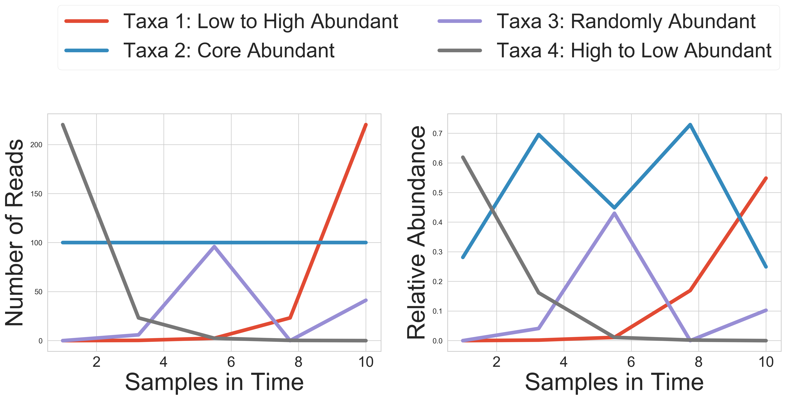
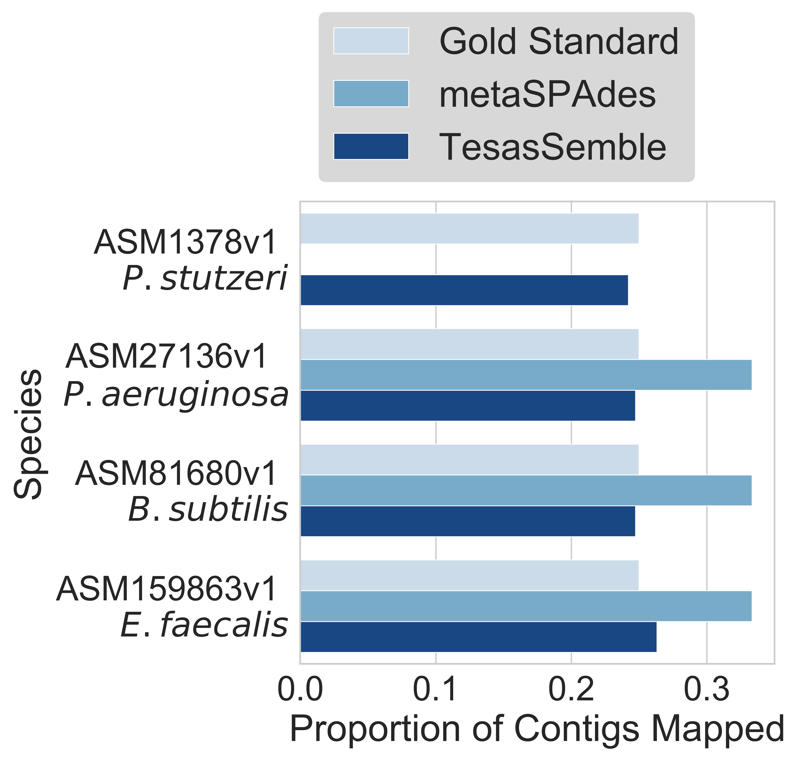

# TesasSemble-benchmarking

Benchmarking for TesasSemble

# simulation_benchmarking

Four simillar taxa (different strains) generated reads over time using the [CAMISM](https://github.com/CAMI-challenge/CAMISIM) generation tool with proportions (fig 1 below) and results (figure 2 below). 

